# Házi feladat specifikáció

Információk [itt](https://viaubxav084.github.io/laborok/hf/)

## Kotlin Multiplatform alapú szoftverfejlesztés 
### 2024/25 2. félév

## Bemutatás

Az alkalmazás képes az egyes sportalkalmakon elvégzett gyakorlatok mennyiségét rögzíteni, illetve gyakorlatokra bontva vonalgrafikont megjeleníteni, mely által látható a sportalkalmak során elvégzett adott gyakorlat mennyiségének változása. A megadható gyakorlatokat a felhasználó beállíthatja. Cél, hogy a sportolások során gyorsan és kényelmesen tudjuk az elért eredményeket rögzíteni, illetve azonnal hozzáférjünk a grafikonokhoz melyekkel láthatjuk a fejlődést vagy akár a visszaesést a teljesítményünkben.

## Főbb funkciók

### Követelmények általi funkciók
Az alkalmazás támogatja a következő platformokat:
- Android
- Desktop (Windows)

Az alkalmazás rendelkezik a következő képernyőkkel:
- Logok (sportolási alkalmak) listázása
- Log hozzáadás/szerkesztés
- Grafikonok
- Beállítások

Az alkalmazás rendelkezik lokális adatbáziskezeléssel, mely aszinkron kommunikációt valósít meg.

Az alkalmazás lehetőséget nyújt az adatok exportálására, mely platform specifikus működést valósít meg.

Az alkalmazás használ Dependency Injectiont

A model MVVM architektúrát használ

### Képernyőnkénti funckiók
Log-ok listázása
- Láthatóak a bejegyzett Logok
- Lehetőség van az adott log szerkesztését elérni, illetve törölni az adott log-ot.
- Lehetőség van elérni a beállításokat, grafikonokat, illetve az új log hozzáadása képernyőt

Felületes, nem végleges képernyőterv: látható az alkalom dátuma és ikonokkal tömören jelezve az akkor elvégzett gyakorlatok. Az egyes elemek kinyithatóak, mely esetén nem csak az elvégzett gyakorlatok, hanem az azokból elvégzett mennyiség is.

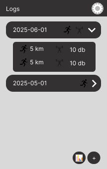

Grafikonok
- Gyakorlatokra bontva vonal diagramok láthatóak, melyeken a gyakorlatokból elvégzett mennyiségek látszódnak az y tengelyen, míg az x tengelyen kategorikusan, időrendben az egyes sportalkalmak szerint.
- Lehetőség van megadni a vizsgált időintervallum kezdetét
- Lehetőség van elérni a beállításokat, logok listázását, illetve az új log hozzáadása képernyőt

Felületes, nem végleges képernyőterv: megnézhető az egyes gyakorlatokból az idő haladtával hogyan változott az elvégzett mennyiségek száma, diagramon vizualizálva. A vizsgált intervallum kezdete módosítható.

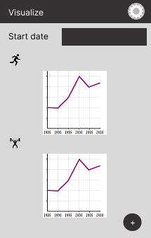

Beállítások
- Lehetőség van a Grafikonoknál található vizsgált időintervallum kezdetét megadó mezőnek default értéket adni
- Lehetőség van exportálni az adatokat
- Lehetőség van megadni, szerkeszteni, illetve törölni a gyakorlat típusokat
  - Gyakorlat neve
  - Gyakorlat mértékegysége
  - Gyakorlat ikona

Felületes, nem végleges képernyőterv: rögzíthető a statisztikák soráni kezdődátum, hogy ne kelljen mindig beállítani. Szintén itt adhatóak meg az elérhető gyakorlatok, melyeket sportalkalom létrehozásakor elérhetőek, illetve utólag szerkeszthetőek, törölhetőek.

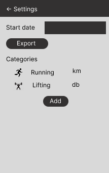

Log hozzáadása
- Gyakorlat ideje megadható
- A beállított gyakorlatokhoz tartozó mezők megjelennek, ahol megadhatóak az azokból elvégzett mennyiség
- A gyakorlat törlése új log létrehozásakor elrejti előlünk a törölt gyakorlatot

Felületes, nem végleges képernyőterv: megadható a dátum, illetve a rendszer által ismert gyakorlatokból elvégzett mennyiség

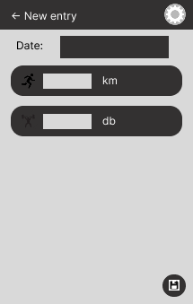

Log szerkesztése
- A hozzáadott loggal megegyező, csak itt azt szerkeszteni lehet

___

# Házi feladat dokumentáció

### Workout

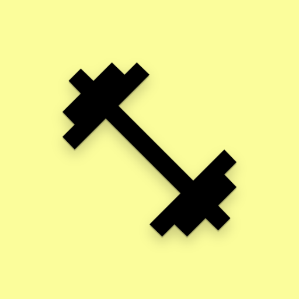

## Bemutatás

Az alkalmazás képes az egyes sportalkalmakon elvégzett gyakorlatok mennyiségét rögzíteni, illetve gyakorlatokra bontva vonalgrafikont megjeleníteni, mely által látható a sportalkalmak során elvégzett adott gyakorlat mennyiségének változása. A megadható gyakorlatokat a felhasználó beállíthatja. Cél, hogy a sportolások során gyorsan és kényelmesen tudjuk az elért eredményeket rögzíteni, illetve azonnal hozzáférjünk a grafikonokhoz melyekkel láthatjuk a fejlődést vagy akár a visszaesést a teljesítményünkben.

## Főbb funkciók

Az alkalmazás támogatja a következő platformokat:
- Android
- Desktop (Windows)

Az alkalmazás rendelkezik a következő képernyőkkel:
- Logok (sportolási alkalmak) listázása
- Log hozzáadás/szerkesztés
- Grafikonok
- Beállítások

Az alkalmazás rendelkezik lokális adatbáziskezeléssel, mely aszinkron kommunikációt valósít meg.

Az alkalmazás lehetőséget nyújt az adatok exportálására, mely platform specifikus működést valósít meg.

Az alkalmazás használ Dependency Injectiont

A model MVVM architektúrát használ

### Képernyőnkénti funckiók
Log-ok listázása
- Láthatóak a bejegyzett Logok
- Lehetőség van az adott log szerkesztését elérni, illetve törölni az adott log-ot.
- Lehetőség van elérni a beállításokat, grafikonokat, illetve az új log hozzáadása képernyőt

Grafikonok
- Gyakorlatokra bontva vonal diagramok láthatóak, melyeken a gyakorlatokból elvégzett mennyiségek látszódnak az y tengelyen, míg az x tengelyen kategorikusan, időrendben az egyes sportalkalmak szerint.
- Lehetőség van megadni a vizsgált időintervallum kezdetét
- Lehetőség van elérni a beállításokat, logok listázását, illetve az új log hozzáadása képernyőt

Beállítások
- Lehetőség van a Grafikonoknál található vizsgált időintervallum kezdetét megadó mezőnek default értéket adni
- Lehetőség van exportálni az adatokat
- Lehetőség van megadni, szerkeszteni, illetve törölni a gyakorlat típusokat
  - Gyakorlat neve
  - Gyakorlat mértékegysége
  - Gyakorlat ikona

Log hozzáadása
- Gyakorlat ideje megadható
- A beállított gyakorlatokhoz tartozó mezők megjelennek, ahol megadhatóak az azokból elvégzett mennyiség
- A gyakorlat törlése új log létrehozásakor elrejti előlünk a törölt gyakorlatot

Log szerkesztése
- A hozzáadott loggal megegyező, csak itt azt szerkeszteni lehet

## Felhasználói kézikönyv

Az alkalmazást megnyitva a Log képernyő fogad minket.

Itt a középen jobb oldalon található két floating buttonnal rendre a következőket tudjuk megtenni
- Bejegyzést hozzáadni
- Átnavigálni a statisztikákat megjelenítő nézetre

Jobb felül a beállításokat tudjuk elérni, ez az alkalmazás egészében ezt a funkciót látja el.

	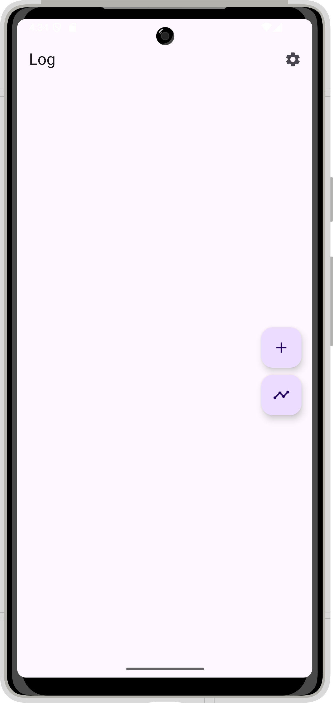

	1. ábra: Log képernyő, jelenleg nem tartalmaz edzés alkalom bejegyzést.

Navigáljunk el a beállításokhoz először! Itt rendre
- megadhatjuk a statisztikák kezdetét (lásd később)
- exportálhatjuk az adatainkat
- létrehozhatunk, szerkeszthetünk, illetve törölhetünk edzés kategóriákat

	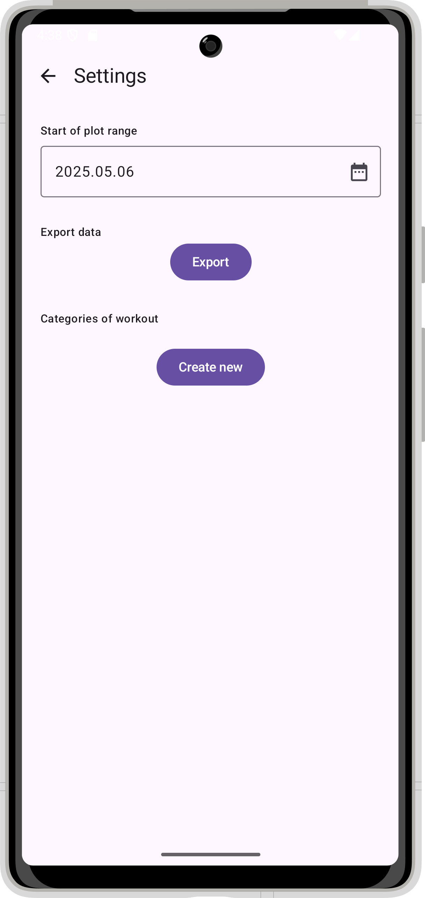

	2. ábra: Settings képernyő, jelenleg nem tartalmaz edzés kategóriát.

Hozzunk létre egy edzés kategóriát a "Create new"-ra kattintva! Itt rendre megadhatjuk a
- Edzés kategória nevét (pl. Futás)
- Edzés kategória mértékegységét (pl. km)
- Edzés ikonját a felsorolt opciók közül

Miután megadtuk az értékeket kattintsunk az Add-ra! Ha esetleg elrontottuk volna, akkor kattintsunk az adott kategória UI elemre mely által tudjuk szerkeszteni az elemet vagy akár a kuka ikonra kattintva tudjuk törölni (a törlés soft delete, így a Log-okat melyekben ez az edzés kategória szerepel nem érinti).

	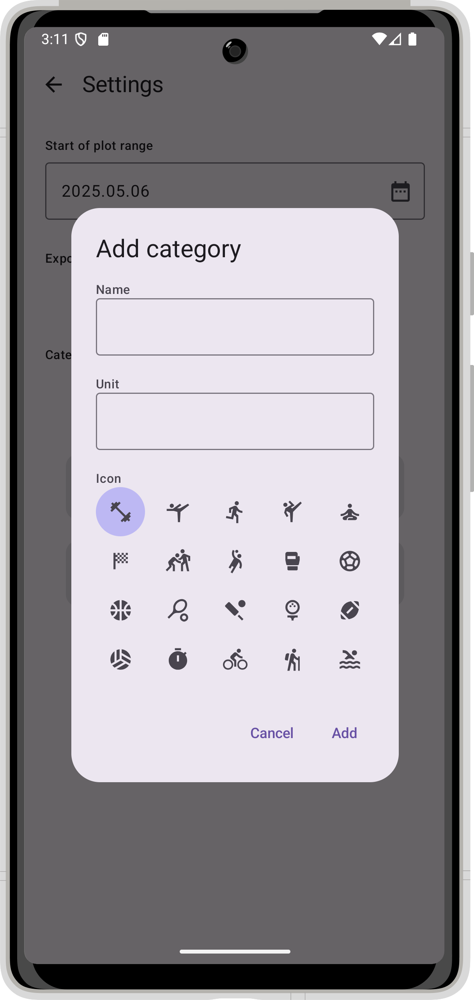
	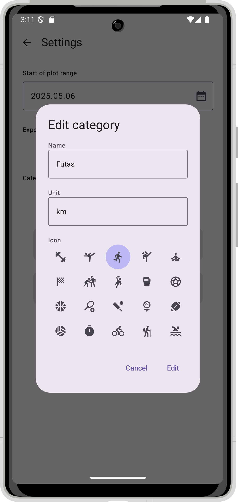

	3. ábra: Kategória létrehozás, illetve szerkesztés

Miután felvettük a kategóriákat navigáljunk a bal felső vissza visszanyíl ikonnal vissza a Logok listázása elemhez, ahol is kattintsunk a Log hozzáadása gombra!

Itt render megadható a
- Log dátuma, azaz annak a dátuma amikor az edzés végeztük
- Az egyes (még nem törölt) edzés kategóriákból elvégzett mennyiség

Ennek során nem szükséges minden kategóriához mennyiséget beírnunk, amely gyakorlatokat nem végeztük el az adott alkalom során azokat hagyjuk üresen!

Ha végeztünk kattintsunk a jobb középen található mentés floating ikonra

	
	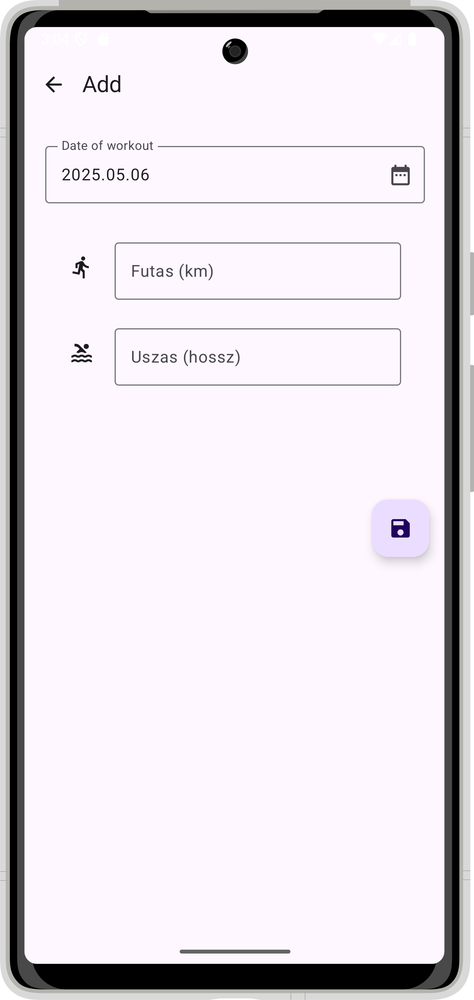
	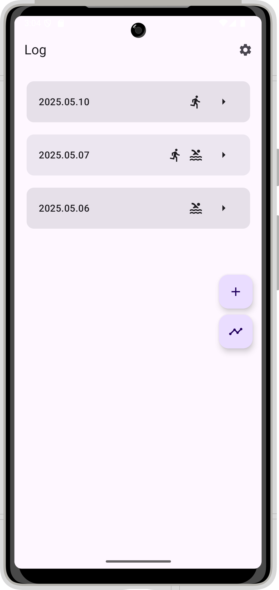

	4. ábra: Log képernyő üresen, Log létrehozás képernyő, Log képernyő felvett bejegyzésekkel

Ha esetleg elrontottuk volna az egyik bejegyzést, akkor kattintsunk a hozzá tartozó UI elemre, mely esetén megjelenik egy ceruza és egy kuka ikon. Ezek segítségével tudjuk szerkeszteni, illetve törölni az egyes elemeket:

	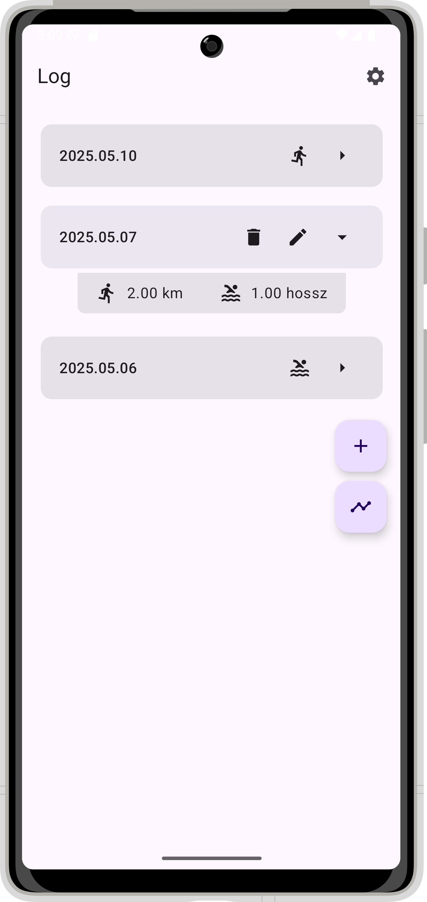
	

	5. ábra: Log elemre kattintott állapot, Log szerkesztés képernyő

A Log képernyőt nézve láthatjuk az egyes Logok dátumát, illetve az azok során elvégzett gyakorlatok ikonjait (egyfajta tömör nézet). Ha egy Log UI elemére kattintunk, akkor a tömör nézethez tartozó ikonok eltűnnek (helyettük törlés és szerkesztés ikon jelenik meg), alattuk megjelenik egy részletesebb nézett, ahol nem csak az elvégzett gyakorlatok ikonjai, hanem az azokból elvégzett mennyiség is látszik.

	
	

	6. ábra: Log képernyő, Log elemre kattintott állapot

Ezután navigáljunk át a Statisztikák nézetre, melyek a jobb középső floating ikonok közül a második lenyomásával érhetünk el.

Itt edzés gyakorlatokra bontva láthatóak vonaldiagramok, melyek megmutatják, hogy az idő haladtával hogyan változott az elvégzett mennyiségek száma. A képernyő tetején beállítható a vizsgált intervallum kezdete. Amennyiben az adott kategóriából kevesebb mint két alkalom érhető el az adott intevallumban, úgy az adott résznél egy szöveges üzenet vár minket.

	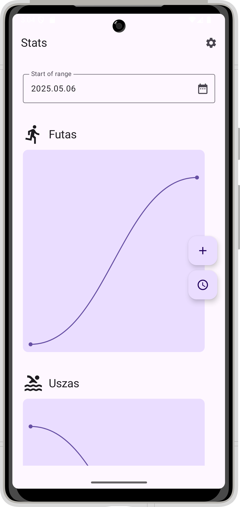

	7. ábra: Statisztikák képernyő

Visszanavigálni a Log-okhoz a jobb középső floating ikonok közül a másodikkal tudunk.

A könnyebb használat érdekében a vizsgált intervallum kezdete perzisztensen elmenthető, ehhez látogassuk meg a beállításokat, ahol az első szekción belül tudjuk ezt beállítani

	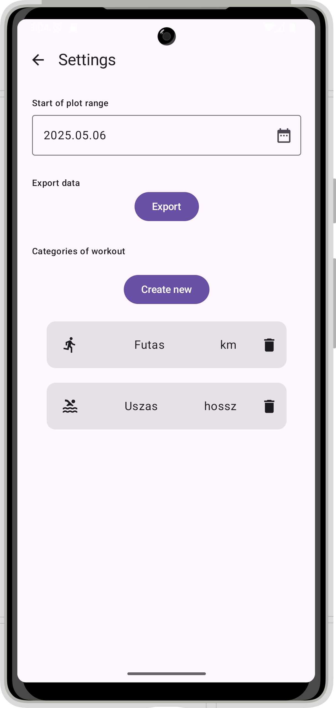

	8. ábra: Beállítások képernyő

Végezetül exportáljuk az adatainkat a beállítoskon belül az Export gombra kattintva, Androidon:

	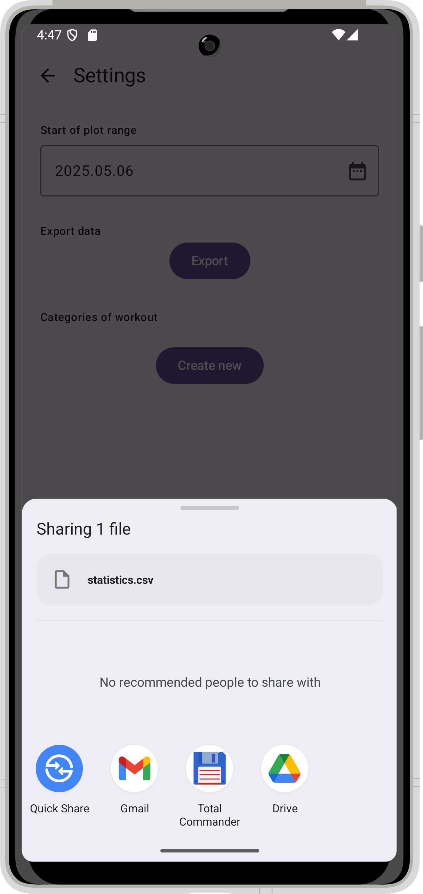

	9. ábra: Exportálás Share Intent segítségével

Illetve ugyanez Desktopon:

	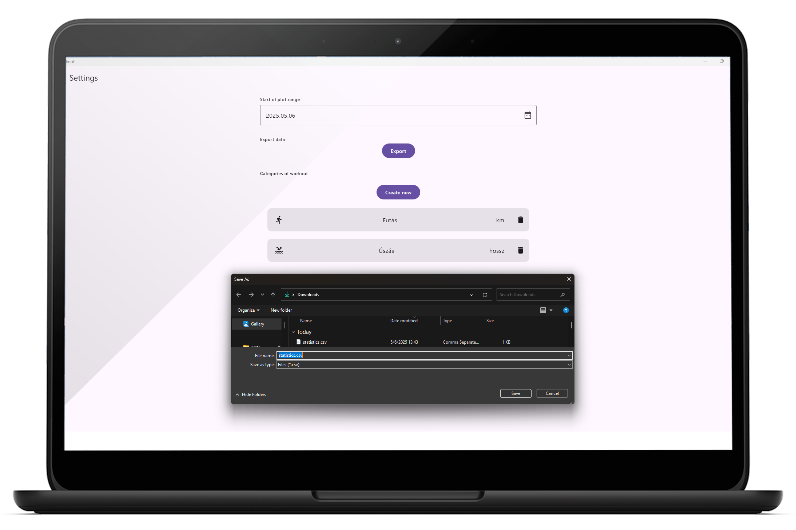

	10. ábra: Exportálás File picker segítségével

## Felhasznált technológiák:

- **Room** az adatok perzisztens adattárolásához
- Compose
  - **AlertDialog** a kategória hozzáadás és szerkesztés nézetekhez
  - **Animáció**
    - Az egyes Logok kinyitásához
    - illetve a kinyitás során az összefoglaló ikon eltűnéséhez
    - illetve a szerkesztő és törlő ikonok megjelenéséhez
  - **Erőforrások** a szövegek kiszervezéséhez (strings.xml)
  - **[dautovicharis/Charts](https://github.com/dautovicharis/Charts)** a vonaldiagramok megjelenítéséhez
- **MVVM** a projekt struktúrálásához
- **Actual-Expect** a platform specifikus exportáláshoz
  - **Intent** az Androidban történő "Share with" alapú exportáláshoz
  - **[FileKit](https://github.com/vinceglb/FileKit)** a Desktopban történő "File choosser dialog" alapú exportáláshoz
- **Koin** a Dependency Injectionhöz
- **Navigation** az oldalak közötti navigáláshoz
- **Flow** az adatbázisból megkapott adatok frissen tartásához

## Fontosabb technológiai megoldások

Számomra fontos tapasztalat volt az MVVM architektúra megismerése.
Ennek során megismertem, hogy hogyan érdemes csoportosítani az egyes fájlainkat, hogy azok nagyobb alkalmazásban is átláthatóak legyenek.
Szintén tanulságos volt, hogy érdemes külön modelleket felvennünk az egyes rétegekhez, hiszen azok eltérően ábrázolhatják ugyanazt.
Ilyen például a
- Soft delete során alkalmazott jelző flag
- Az ikonok UI-ban IconVectorok, míg máshol szövegek
Meglepő volt számomra, hogy a ViewModelbe elkülönítjük a UI állapotát, majd azzal előre meghatározott eseményekkel kommunikálunk.
